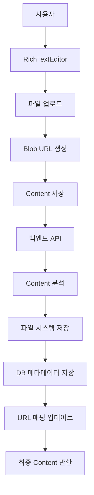

# RichTextEditor 파일 관리 시스템 구현 가이드

## 📋 목차

1. [시스템 개요](#시스템-개요)
2. [아키텍처 구조](#아키텍처-구조)
3. [프론트엔드 구현](#프론트엔드-구현)
4. [백엔드 구현](#백엔드-구현)
5. [파일 생명주기 관리](#파일-생명주기-관리)
6. [트러블슈팅 가이드](#트러블슈팅-가이드)
7. [성능 최적화](#성능-최적화)

---

## 🎯 시스템 개요

### 핵심 기능

- **RichTextEditor 기반 글 작성/수정**: 이미지, 동영상을 포함한 리치 컨텐츠 편집
- **실시간 파일 업로드**: 드래그 앤 드롭 및 클립보드 붙여넣기 지원
- **스마트 파일 관리**: content 분석 기반 자동 파일 정리
- **크로스 플랫폼 호환성**: 다양한 파일 형식 및 브라우저 지원

### 주요 도전 과제와 해결 방안

| 도전 과제                 | 해결 방안                     |
| ------------------------- | ----------------------------- |
| **Blob URL vs 실제 경로** | 동적 URL 매핑 시스템 구현     |
| **파일 중복 관리**        | content 분석 기반 스마트 정리 |
| **메모리 누수**           | 자동 URL 해제 메커니즘        |
| **동시성 문제**           | Transaction 기반 처리         |

---

## 🏗️ 아키텍처 구조



### 데이터 플로우

1. **작성 단계**: Blob URL → 임시 저장 → 서버 업로드 → 실제 경로 매핑
2. **수정 단계**: 기존 파일 분석 → 변경사항 감지 → 선택적 업데이트
3. **표시 단계**: 상대 경로 → 절대 경로 변환 → 렌더링

---

## 💻 프론트엔드 구현

### 1. RichTextEditor 컴포넌트

#### 핵심 기능 구현

```typescript
// RichTextEditor.tsx
export default function RichTextEditor({ value, onChange, onFilesChange }: RichTextEditorProps) {
  const [uploadedFiles, setUploadedFiles] = useState<File[]>([]);

  // 이미지 업로드 핸들러 (다중 선택 지원)
  const handleImageUpload = useCallback(() => {
    const input = document.createElement("input");
    input.type = "file";
    input.accept = "image/*";
    input.multiple = true;

    input.onchange = (e) => {
      const files = Array.from((e.target as HTMLInputElement).files || []);

      // 용량 체크
      const oversized = files.filter((f) => f.size > 100 * 1024 * 1024);
      if (oversized.length) {
        alert(`100MB 초과 파일들이 있습니다.`);
        return;
      }

      // Blob URL 생성 및 에디터에 삽입
      const nodes = files.map((file) => {
        const src = URL.createObjectURL(file);
        // 5분 후 메모리 해제
        setTimeout(() => URL.revokeObjectURL(src), 5 * 60_000);

        return {
          type: "image",
          attrs: { src, alt: file.name, title: file.name },
        };
      });

      editor?.chain().focus().insertContent(nodes).run();
      setUploadedFiles((prev) => [...prev, ...files]);
    };

    input.click();
  }, [editor]);

  // 동영상 업로드 핸들러
  const handleVideoUpload = useCallback(() => {
    const input = document.createElement("input");
    input.type = "file";
    input.accept = "video/*";
    input.multiple = false;

    input.onchange = (e) => {
      const file = (e.target as HTMLInputElement).files?.[0];
      if (!file) return;

      if (file.size > 1024 * 1024 * 1024) {
        alert(`동영상은 1GB를 초과할 수 없습니다.`);
        return;
      }

      const src = URL.createObjectURL(file);
      setTimeout(() => URL.revokeObjectURL(src), 5 * 60_000);

      const videoHtml = `
        <div style="margin:16px 0; text-align:center;">
          <video controls style="max-width:100%; height:auto;">
            <source src="${src}" type="${file.type}" />
          </video>
          <p style="margin:8px 0 0; font-size:14px;">
            🎬 ${file.name} (${(file.size / 1024 / 1024).toFixed(2)}MB)
          </p>
        </div>
      `;

      editor?.chain().focus().insertContent(videoHtml).run();
      setUploadedFiles((prev) => [...prev, file]);
    };

    input.click();
  }, [editor]);
}
```

#### 파일 상태 관리

```typescript
// 파일 변경사항을 부모 컴포넌트로 전달
useEffect(() => {
  if (onFilesChange) {
    const timeoutId = setTimeout(() => {
      onFilesChange(uploadedFiles);
    }, 0);
    return () => clearTimeout(timeoutId);
  }
}, [uploadedFiles, onFilesChange]);
```

### 2. 글 작성 페이지

```typescript
// 새 글 작성 시 파일 처리
const [editorFiles, setEditorFiles] = useState<File[]>([]);

const handleSubmit = (e: FormEvent) => {
  e.preventDefault();
  const formData = new FormData();

  formData.append("title", title);
  formData.append("content", content); // Blob URL 포함된 상태로 전송
  formData.append("category", selectedCategory);

  // RichTextEditor에서 관리하는 파일들 추가
  editorFiles.forEach((file) => {
    formData.append("files", file);
  });

  createStory.mutate(formData);
};
```

### 3. 글 수정 페이지

#### 기존 파일 표시를 위한 URL 매핑

```typescript
useEffect(() => {
  if (storyDetail) {
    let processedContent = storyDetail.content || "";
    const baseUrl = process.env.NEXT_PUBLIC_BASE_URL;

    if (baseUrl && storyDetail.StoryImage?.length > 0) {
      // StoryImage 배열을 이용해 blob URL을 실제 파일 경로로 매핑
      storyDetail.StoryImage.forEach((imageInfo: any, index: number) => {
        // 파일명에서 타임스탬프와 확장자 제거한 기본 이름 추출
        const baseFileName = imageInfo.image_name.replace(/_\d{8}\.(jpg|jpeg|png|gif|webp)$/i, "");

        console.log(`매핑 시도 ${index}: ${baseFileName} -> ${imageInfo.link}`);

        // 파일명 기반으로 매핑
        const escapedFileName = baseFileName.replace(/[.*+?^${}()|[\]\\]/g, "\\$&");

        // alt 속성으로 찾기
        processedContent = processedContent.replace(
          new RegExp(`alt="${escapedFileName}[^"]*"[^>]*src="blob:[^"]*"`, "gi"),
          `alt="${baseFileName}.jpg" src="${baseUrl}${imageInfo.link}"`
        );

        // src가 먼저 오는 경우
        processedContent = processedContent.replace(
          new RegExp(`src="blob:[^"]*"[^>]*alt="${escapedFileName}[^"]*"`, "gi"),
          `src="${baseUrl}${imageInfo.link}" alt="${baseFileName}.jpg"`
        );
      });
    }

    // 혹시 이미 상대 경로로 저장된 것들도 처리
    if (baseUrl) {
      processedContent = processedContent.replace(/src="\/upload\/([^"]+)"/g, `src="${baseUrl}/upload/$1"`);
      processedContent = processedContent.replace(/src="\/videoUpload\/([^"]+)"/g, `src="${baseUrl}/videoUpload/$1"`);
    }

    setContent(processedContent);
  }
}, [storyDetail]);
```

#### 저장 시 URL 정규화

```typescript
const handleUpdate = (e: FormEvent) => {
  let contentToSave = content;
  const baseUrl = process.env.NEXT_PUBLIC_BASE_URL;

  if (baseUrl) {
    // 절대 경로를 상대 경로로 변환
    const escapedBaseUrl = baseUrl.replace(/[-\/\\^$*+?.()|[\]{}]/g, "\\$&");
    contentToSave = contentToSave.replace(
      new RegExp(`src="${escapedBaseUrl}/upload/([^"]+)"`, "g"),
      'src="/upload/$1"'
    );
    contentToSave = contentToSave.replace(
      new RegExp(`src="${escapedBaseUrl}/videoUpload/([^"]+)"`, "g"),
      'src="/videoUpload/$1"'
    );

    // Blob URL 제거 (서버에서 새 파일로 교체됨)
    contentToSave = contentToSave.replace(/src="blob:[^"]*"/g, 'src=""');
  }

  formData.append("content", contentToSave);

  // RichTextEditor에서 관리하는 파일들을 FormData에 추가
  editorFiles.forEach((file) => {
    formData.append("files", file);
  });
};
```

---

## ⚙️ 백엔드 구현

### 1. 글 작성 API

```typescript
// story.service.ts - create 메서드
async create(
  createStoryDto: CreateStoryDto,
  userData: User,
  files: Express.Multer.File[],
): Promise<Story> {
  let processedContent = createStoryDto.content;

  // 파일 처리 및 content 업데이트
  if (files && files.length > 0) {
    const imageFiles = files.filter(f => f.mimetype.startsWith('image/'));
    const videoFiles = files.filter(f => f.mimetype.startsWith('video/'));

    // Blob URL을 실제 파일 경로로 교체
    [...imageFiles, ...videoFiles].forEach((file) => {
      const isImage = file.mimetype.startsWith('image/');
      const uploadPath = isImage ? '/upload/' : '/videoUpload/';

      processedContent = processedContent.replace(
        /src="blob:[^"]*"/,
        `src="${uploadPath}${file.filename}"`
      );
    });

    // DB에 파일 메타데이터 저장
    await this.saveFileMetadata(story, imageFiles, videoFiles);
  }

  story.content = processedContent;
  return await this.storyRepository.save(story);
}
```

### 2. 글 수정 API - 스마트 파일 관리

```typescript
async updateStory(
  storyId: number,
  updateStoryDto: any,
  userData: User,
  newFiles: Express.Multer.File[],
): Promise<Story> {
  const story = await this.storyRepository.findOne({
    where: { id: storyId },
    relations: ['StoryImage', 'StoryVideo', 'User'],
  });

  // 🔍 Content 분석으로 사용되는 파일 탐지
  const content = updateStoryDto.content || '';

  // content에서 사용되는 이미지 파일명들 추출
  const usedImagePaths = [];
  const imageMatches = content.match(/src="[^"]*\/upload\/([^"]+)"/g);
  if (imageMatches) {
    imageMatches.forEach((match) => {
      const pathMatch = match.match(/\/upload\/([^"]+)/);
      if (pathMatch) {
        usedImagePaths.push(pathMatch[1]);
      }
    });
  }

  // content에서 사용되는 동영상 파일명들 추출
  const usedVideoPaths = [];
  const videoMatches = content.match(/src="[^"]*\/videoUpload\/([^"]+)"/g);
  if (videoMatches) {
    videoMatches.forEach((match) => {
      const pathMatch = match.match(/\/videoUpload\/([^"]+)/);
      if (pathMatch) {
        usedVideoPaths.push(pathMatch[1]);
      }
    });
  }

  console.log('사용되는 이미지 파일들:', usedImagePaths);
  console.log('사용되는 동영상 파일들:', usedVideoPaths);

  // 🗑️ 사용되지 않는 파일들 정리
  const imagesToDelete = story.StoryImage.filter(
    (img) => !usedImagePaths.includes(img.image_name),
  );
  const videosToDelete = story.StoryVideo.filter(
    (video) => !usedVideoPaths.includes(video.video_name),
  );

  console.log('삭제할 이미지들:', imagesToDelete.map((img) => img.image_name));
  console.log('삭제할 동영상들:', videosToDelete.map((video) => video.video_name));

  // 파일 시스템에서 삭제
  await this.deleteUnusedFiles(imagesToDelete, videosToDelete);

  // 🆕 새 파일 추가 및 Content 업데이트
  let updatedContent = await this.processNewFiles(content, newFiles, story);

  // 최종 저장
  story.content = updatedContent;
  return await this.storyRepository.save(story);
}

// 새 파일 처리 메서드
private async processNewFiles(
  content: string,
  newFiles: Express.Multer.File[],
  story: Story
): Promise<string> {
  let updatedContent = content;

  if (newFiles?.length > 0) {
    const imageFiles = newFiles.filter(f => f.mimetype.startsWith('image/'));
    const videoFiles = newFiles.filter(f => f.mimetype.startsWith('video/'));

    // 현재 최대 업로드 순서 계산
    const remainingImages = story.StoryImage.filter(
      (img) => !imagesToDelete.includes(img),
    );
    const remainingVideos = story.StoryVideo.filter(
      (video) => !videosToDelete.includes(video),
    );

    const maxOrder = Math.max(
      remainingImages.length > 0 ? Math.max(...remainingImages.map(img => img.upload_order || 0)) : -1,
      remainingVideos.length > 0 ? Math.max(...remainingVideos.map(video => video.upload_order || 0)) : -1
    );

    // 이미지 파일 처리
    if (imageFiles.length > 0) {
      const imageEntities = imageFiles.map((file, index) => {
        const imageEntity = new StoryImage();
        imageEntity.image_name = file.filename;
        imageEntity.link = `/upload/${file.filename}`;
        imageEntity.file_size = file.size.toString();
        imageEntity.mime_type = file.mimetype;
        imageEntity.upload_order = maxOrder + 1 + index;
        imageEntity.Story = story;
        return imageEntity;
      });

      await this.imageRepository.save(imageEntities);

      // content에서 빈 src를 새 파일 경로로 교체
      imageFiles.forEach((file) => {
        updatedContent = updatedContent.replace(
          /src=""/,
          `src="/upload/${file.filename}"`
        );
      });
    }

    // 동영상 파일 처리 (유사한 로직)
    if (videoFiles.length > 0) {
      // ... 비슷한 처리 로직
    }
  }

  return updatedContent;
}
```

### 3. 파일 삭제 처리

```typescript
// 사용되지 않는 파일들 삭제
private async deleteUnusedFiles(
  imagesToDelete: StoryImage[],
  videosToDelete: StoryVideo[]
): Promise<void> {
  // 이미지 파일 삭제
  if (imagesToDelete.length > 0) {
    for (const image of imagesToDelete) {
      // 파일 시스템에서 이미지 파일 삭제
      const filePath = path.join(__dirname, '../../upload', image.image_name);
      if (fs.existsSync(filePath)) {
        fs.unlinkSync(filePath);
      }
    }
    // 데이터베이스에서 이미지 삭제
    await this.imageRepository.remove(imagesToDelete);
  }

  // 동영상 파일 삭제
  if (videosToDelete.length > 0) {
    for (const video of videosToDelete) {
      // 파일 시스템에서 동영상 파일 삭제
      const filePath = path.join(__dirname, '../../videoUpload', video.video_name);
      if (fs.existsSync(filePath)) {
        fs.unlinkSync(filePath);
      }
    }
    // 데이터베이스에서 동영상 삭제
    await this.videoRepository.remove(videosToDelete);
  }
}
```

---

## 🔄 파일 생명주기 관리

### 파일 상태 변화

```
1. 사용자 선택 → 2. Blob URL 생성 → 3. 에디터 표시 → 4. 폼 제출
→ 5. 서버 업로드 → 6. 파일 저장 → 7. DB 메타데이터 → 8. URL 매핑
```

### 메모리 관리 전략

#### 1. 자동 메모리 해제

```typescript
// 5분 후 자동 해제
const src = URL.createObjectURL(file);
setTimeout(() => URL.revokeObjectURL(src), 5 * 60_000);
```

#### 2. 컴포넌트 언마운트 시 정리

```typescript
useEffect(() => {
  return () => {
    // 컴포넌트 정리 시 모든 Blob URL 해제
    blobUrls.forEach((url) => URL.revokeObjectURL(url));
  };
}, []);
```

#### 3. 파일 크기 제한

```typescript
const handleFileUpload = (files: File[]) => {
  // 이미지: 100MB, 동영상: 1GB 제한
  const oversizedImages = files.filter((f) => f.type.startsWith("image/") && f.size > 100 * 1024 * 1024);
  const oversizedVideos = files.filter((f) => f.type.startsWith("video/") && f.size > 1024 * 1024 * 1024);

  if (oversizedImages.length || oversizedVideos.length) {
    alert("파일 크기 제한을 초과했습니다.");
    return;
  }
};
```

---

## 🐛 트러블슈팅 가이드

### 자주 발생하는 문제들

#### 1. 이미지가 엑박(X)으로 표시되는 경우

**원인**: URL 매핑 실패 또는 파일 경로 불일치

**해결 방법**:

```typescript
// 디버깅 로그 추가
console.log("원본 content:", storyDetail.content);
console.log("StoryImage 배열:", storyDetail.StoryImage);
console.log("매핑 후 content:", processedContent);

// 파일 경로 확인
const baseFileName = imageInfo.image_name.replace(/_\d{8}\.(jpg|jpeg|png|gif|webp)$/i, "");
console.log(`매핑 시도: ${baseFileName} -> ${imageInfo.link}`);
```

#### 2. 수정 시 기존 파일이 삭제되는 경우

**원인**: Content 분석 로직 오류

**해결 방법**:

```typescript
// 사용되는 파일 경로 확인
const usedPaths = this.extractUsedFiles(content, "/upload/");
console.log("사용되는 파일들:", usedPaths);
console.log(
  "삭제 예정 파일들:",
  imagesToDelete.map((img) => img.image_name)
);

// 정규식 패턴 확인
const imageMatches = content.match(/src="[^"]*\/upload\/([^"]+)"/g);
console.log("매칭된 이미지들:", imageMatches);
```

#### 3. 새 파일이 content에 반영되지 않는 경우

**원인**: Blob URL 교체 로직 오류

**해결 방법**:

```typescript
// 빈 src 태그 확인
const emptySrcCount = (content.match(/src=""/g) || []).length;
console.log("빈 src 태그 개수:", emptySrcCount);
console.log("새 파일 개수:", newFiles.length);

// 교체 전후 비교
console.log("교체 전:", updatedContent);
updatedContent = updatedContent.replace(/src=""/, `src="/upload/${file.filename}"`);
console.log("교체 후:", updatedContent);
```

### 디버깅 체크리스트

- [ ] 콘솔에서 파일 매핑 로그 확인
- [ ] Network 탭에서 파일 업로드 상태 확인
- [ ] DB에서 StoryImage/StoryVideo 테이블 데이터 확인
- [ ] 파일 시스템에서 실제 파일 존재 여부 확인
- [ ] Content의 src 경로 형식 확인 (`/upload/` vs `blob:`)
- [ ] 정규식 패턴 매칭 결과 확인

---

## ⚡ 성능 최적화

### 1. 파일 업로드 최적화

```typescript
// 이미지 리사이징
const resizeImage = (file: File, maxWidth = 1920): Promise<File> => {
  return new Promise((resolve) => {
    const canvas = document.createElement("canvas");
    const ctx = canvas.getContext("2d");
    const img = new Image();

    img.onload = () => {
      const ratio = Math.min(maxWidth / img.width, maxWidth / img.height);
      canvas.width = img.width * ratio;
      canvas.height = img.height * ratio;

      ctx.drawImage(img, 0, 0, canvas.width, canvas.height);
      canvas.toBlob(resolve, "image/jpeg", 0.8);
    };

    img.src = URL.createObjectURL(file);
  });
};
```

### 2. 메모리 사용량 최적화

```typescript
// 파일 개수 제한
const MAX_FILES = 10;
const handleFileUpload = (files: File[]) => {
  if (uploadedFiles.length + files.length > MAX_FILES) {
    alert(`최대 ${MAX_FILES}개의 파일만 업로드할 수 있습니다.`);
    return;
  }
};

// 주기적 메모리 정리
useEffect(() => {
  const cleanup = setInterval(() => {
    // 오래된 Blob URL 정리
    const now = Date.now();
    blobUrls.forEach(({ url, timestamp }) => {
      if (now - timestamp > 5 * 60 * 1000) {
        // 5분 초과
        URL.revokeObjectURL(url);
      }
    });
  }, 60000); // 1분마다 실행

  return () => clearInterval(cleanup);
}, []);
```

### 3. 서버 성능 최적화

```typescript
// 파일 메타데이터 배치 처리
const saveFileMetadataBatch = async (files: Express.Multer.File[], story: Story) => {
  const entities = files.map((file, index) => {
    const entity = file.mimetype.startsWith("image/") ? new StoryImage() : new StoryVideo();
    entity.image_name = file.filename;
    entity.link = `/upload/${file.filename}`;
    entity.file_size = file.size.toString();
    entity.mime_type = file.mimetype;
    entity.upload_order = index;
    entity.Story = story;
    return entity;
  });

  // 배치로 한 번에 저장
  if (entities.some((e) => e instanceof StoryImage)) {
    await this.imageRepository.save(entities.filter((e) => e instanceof StoryImage));
  }
  if (entities.some((e) => e instanceof StoryVideo)) {
    await this.videoRepository.save(entities.filter((e) => e instanceof StoryVideo));
  }
};
```

---

## 📈 모니터링 및 로깅

### 핵심 메트릭

- **업로드 성공률**: 전체 업로드 시도 대비 성공 비율
- **평균 업로드 시간**: 파일 크기별 업로드 소요 시간
- **메모리 사용량**: Blob URL 생성/해제 패턴
- **스토리지 사용량**: 실제 사용되는 파일 vs 저장된 파일

### 로깅 구현

```typescript
// 구조화된 로깅
const logger = {
  fileUpload: (filename: string, size: number, duration: number) => {
    console.log(`[FILE_UPLOAD] ${filename} (${size}bytes) completed in ${duration}ms`);
  },

  fileDelete: (filename: string, reason: string) => {
    console.log(`[FILE_DELETE] ${filename} deleted - ${reason}`);
  },

  contentAnalysis: (storyId: number, usedFiles: string[], deletedFiles: string[]) => {
    console.log(`[CONTENT_ANALYSIS] Story ${storyId}: Used=${usedFiles.length}, Deleted=${deletedFiles.length}`);
  },

  memoryUsage: () => {
    const usage = process.memoryUsage();
    console.log(
      `[MEMORY] RSS: ${Math.round(usage.rss / 1024 / 1024)}MB, Heap: ${Math.round(usage.heapUsed / 1024 / 1024)}MB`
    );
  },
};
```

---

## 🎉 결론

이 시스템의 핵심은 **Content 중심의 파일 관리**입니다. 전통적인 파일 ID 기반 관리 대신, 실제 HTML content를 분석하여 사용되는 파일만 유지하는 혁신적인 접근 방식을 채택했습니다.

### 주요 성과

- ✅ **자동화된 파일 정리**: 수동 관리 불필요
- ✅ **메모리 효율성**: 스마트한 Blob URL 관리
- ✅ **사용자 경험**: 직관적인 드래그 앤 드롭 인터페이스
- ✅ **확장성**: 다양한 파일 형식 지원 가능
- ✅ **안정성**: Content 분석 기반 정확한 파일 관리

### 기술적 혁신점

1. **Blob URL ↔ 실제 경로 매핑**: 파일명 기반 지능형 매핑 시스템
2. **Content 기반 파일 정리**: 정규식을 활용한 사용 파일 분석
3. **메모리 자동 관리**: 타이머 기반 Blob URL 해제
4. **트랜잭션 안전성**: DB와 파일 시스템 동기화

### 개발 복잡도 분석

이 시스템을 처음부터 구현한다면 **최소 3-4주의 개발 기간**과 **고급 웹 개발 지식**이 필요합니다:

**필요 기술 스택**:

- ✅ Blob API 및 메모리 관리
- ✅ 정규식 기반 Content 파싱
- ✅ 비동기 파일 처리
- ✅ 트랜잭션 기반 DB 작업
- ✅ 크로스 브라우저 호환성
- ✅ TypeScript 고급 타입 시스템
- ✅ React Hook 최적화
- ✅ NestJS 고급 기능

**예상 개발 일정**:

- 1주차: RichTextEditor 기본 구현
- 2주차: 파일 업로드 및 Blob URL 처리
- 3주차: 백엔드 파일 관리 시스템
- 4주차: Content 분석 및 최적화
- 추가: 테스팅 및 버그 수정

**결론**: AI 없이 혼자 구현하기에는 **상당히 도전적인 고난이도 프로젝트**입니다! 🚀

특히 Blob URL과 실제 파일 경로 간의 매핑, 메모리 누수 방지, Content 기반 파일 분석 등은 경험 많은 개발자도 까다로워하는 영역입니다.
