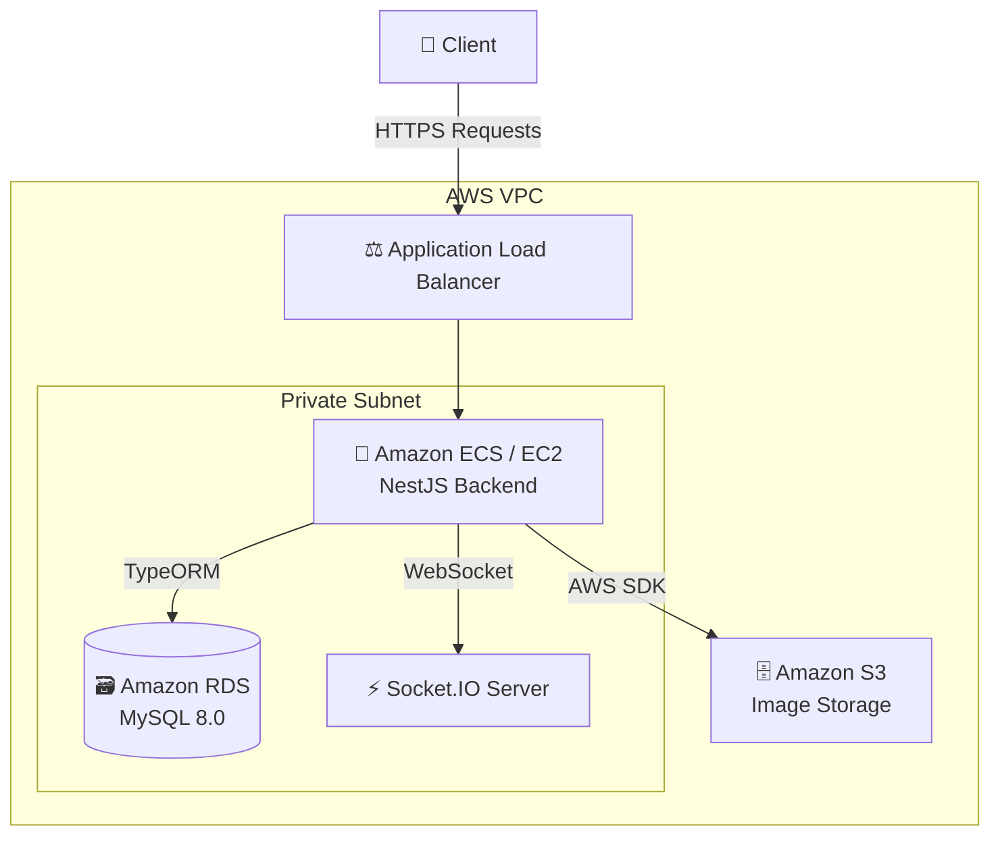

# 📚 Study Board Backend

Study Board는 학습 커뮤니티 및 실시간 소통을 위한 종합 플랫폼의 백엔드 서버입니다.
안정적인 프로세스 관리와 모던한 백엔드 아키텍처를 지향하며 설계되었습니다.

## 🏗️ Architecture



## 🚀 기술 스택 (Tech Stack)

### Core
- **Framework:** NestJS (v10)
- **Language:** TypeScript 
- **Database:** MySQL 8.0 / TypeORM
- **Authentication:** Passport.js / JWT / bcryptjs

### Real-time & Infrastructure
- **WebSocket:** Socket.IO (v4)
- **Cloud Storage:** AWS S3 (`@aws-sdk/client-s3`, `multer-s3`)
- **API Docs:** Swagger (`@nestjs/swagger`)

## 🏛️ 주요 기능 및 기술적 포인트 (Technical Highlights)

이 백엔드는 단순한 CRUD를 넘어, 데이터의 정합성과 확장성을 고려하여 개발되었습니다.

1. **클린 아키텍처 기반의 모듈화 (Modular Design)**
   - 도메인, 애플리케이션, 인프라 계층을 강하게 분리하는 설계를 지향.
   - 결합도를 낮추고 유지보수 및 테스트가 용이하도록 NestJS의 의존성 주입(DI) 적극 활용.
2. **실시간 데이터 처리 (Real-time Communication)**
   - `Socket.IO` 네임스페이스와 룸(Room)을 활용한 다중 채널 채팅 및 시스템 알림 구현.
3. **AWS 클라우드 생태계 통합**
   - `@aws-sdk/client-s3`와 `multer-s3`를 연동하여 이미지/파일 메타데이터 관리 및 다이렉트 업로드 구현.
4. **인증 및 보안 (Security & Auth)**
   - `Passport`와 `JWT`를 결합하여 확장 가능하고 안전한 Stateless 인증 시스템 구축.
   - `helmet`을 적용하여 기본적인 HTTP 헤더 보안 계층 추가 강화.

## ⚙️ 빠른 시작 (Getting Started)

### 1. 사전 요구사항 (Prerequisites)
- Node.js 20+
- MySQL 8.0+

### 2. 환경 변수 설정
`src` 디렉토리 혹은 루트에 위치한 환경 설정 파일(예: `.env`)에 다음 값들을 구성해야 합니다.

```env
# Database (MySQL)
DB_HOST=localhost
DB_PORT=3306
DB_USER=your_db_user
DB_PASSWORD=your_db_password
DB_NAME=board-study

# JWT
JWT_SECRET=your_jwt_secret_key

# AWS
AWS_S3_BUCKET_NAME=your_s3_bucket
AWS_ACCESS_KEY_ID=your_access_key
AWS_SECRET_ACCESS_KEY=your_secret_key
AWS_REGION=ap-northeast-2
```

### 3. 설치 및 실행 (Install & Run)

```bash
# 의존성 패키지 설치
npm install

# 개발 환경 실행 (Hot-reload)
npm run start:dev

# 프로덕션용 빌드 및 실행
npm run build
npm run start:prod
```

## 🌐 API 명세서 (API Documentation)

로컬 서버 구동 후, 아래 주소에서 Swagger UI를 통해 명세된 모든 RESTful API 엔드포인트를 확인하고 직접 테스트해 볼 수 있습니다.

- **Swagger UI:** [http://localhost:8888/api](http://localhost:8888/api)
- **WebSocket:** `http://localhost:8888/socket.io/`

## 🛠️ 개발 워크플로우 명렁어 (Commands)

```bash
# 코드 포맷팅 & 린터 검사
npm run format
npm run lint

# 단위 테스트 실행
npm run test

# 테스트 커버리지 리포트 출력
npm run test:cov
```
