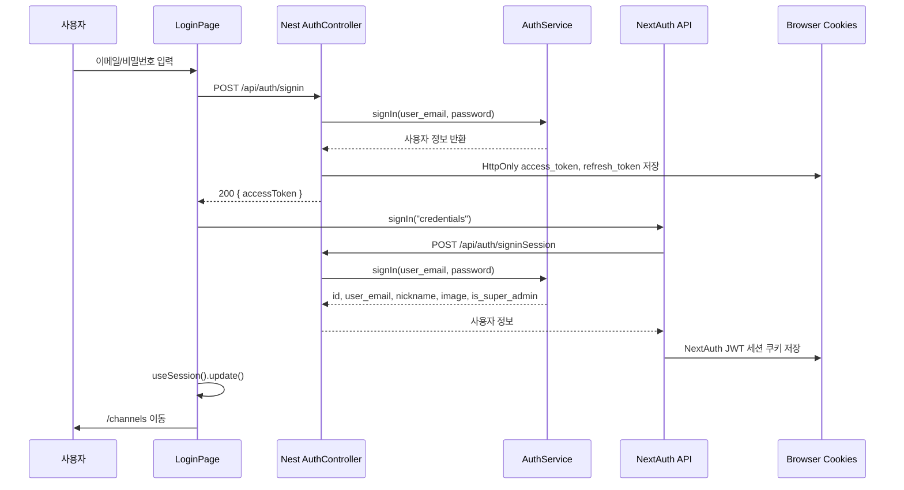

# Study-Board 인증 흐름 정리

업데이트 기준: 현재 소스 코드 기준

이 문서는 오랜만에 프로젝트를 다시 봐도 로그인, 회원가입, 세션, JWT 쿠키가 어디서 시작해서 어디로 흘러가는지 바로 떠올릴 수 있게 정리한 문서입니다. 특히 현재 코드는 인증 상태를 한 군데에서만 관리하지 않습니다.

현재 구조의 핵심은 다음 한 줄입니다.

> 프론트 화면의 로그인 상태는 NextAuth 세션으로 보고, 백엔드 API 권한 검사는 HttpOnly JWT 쿠키로 한다.

그래서 일반 로그인은 실제로 두 번의 인증 요청이 이어집니다.

1. 백엔드 `/api/auth/signin`으로 `access_token`, `refresh_token` 쿠키를 받는다.
2. NextAuth `signIn("credentials")`로 `useSession()`에서 쓸 프론트 세션을 만든다.

---

## 큰 그림



왜 이렇게 두 갈래로 되어 있냐면 역할이 다릅니다.

| 구분 | 담당 | 쓰는 곳 | 저장 위치 |
| --- | --- | --- | --- |
| NextAuth 세션 | 프론트 로그인 상태, `useSession()`, 일부 라우트 보호 | `front/` | NextAuth가 관리하는 JWT 세션 쿠키 |
| 백엔드 JWT | NestJS API 권한 검사, `@UseGuards(AuthGuard())` | `back/` | `access_token`, `refresh_token` HttpOnly 쿠키 |

---

## 빠른 소스 위치

| 보고 싶은 것 | 파일 |
| --- | --- |
| 로그인 화면 submit | `front/src/app/(beforeLogin)/login/page.tsx` |
| 회원가입 화면 submit | `front/src/app/(beforeLogin)/signup/page.tsx` |
| 회원가입 프론트 검증 | `front/src/schemas/auth.ts` |
| NextAuth 설정 | `front/src/pages/api/auth/[...nextauth].ts` |
| NextAuth 타입 확장 | `front/src/app/types/next-auth.d.ts` |
| NextAuth Provider | `front/src/app/components/Provider/AuthSessionCom.tsx` |
| 프론트 라우트 미들웨어 | `front/src/middleware.ts` |
| API axios 인스턴스, 401 refresh 처리 | `front/src/app/api/axios.ts` |
| 로그아웃 버튼 흐름 | `front/src/app/components/TopBar.tsx` |
| 로컬 로그아웃 플래그 | `front/src/app/store/authUiStore.ts` |
| 백엔드 auth 엔드포인트 | `back/src/auth/auth.controller.ts` |
| 회원가입/로그인 비즈니스 로직 | `back/src/auth/auth.service.ts` |
| JWT 쿠키 검증 전략 | `back/src/auth/jwt.strategy.ts` |
| `req.user` 꺼내는 데코레이터 | `back/src/common/decorators/get-user.decorator.ts` |
| access token 만료 상수 | `back/src/constants/tokenTime.ts` |
| CORS, cookieParser 설정 | `back/src/main.ts` |

---

## 일반 로그인 흐름

시작 파일은 `front/src/app/(beforeLogin)/login/page.tsx`입니다.

### 1단계: 백엔드 JWT 쿠키 발급

`handleLogin()`이 먼저 백엔드로 요청합니다.

```ts
axios.post(`${NEXT_PUBLIC_BASE_URL}/api/auth/signin`, {
  user_email: email,
  password,
}, { withCredentials: true })
```

백엔드 이동 경로는 다음과 같습니다.

1. `back/src/auth/auth.controller.ts`
   `AuthController.signin()`
2. `back/src/auth/auth.service.ts`
   `AuthService.signIn()`
3. `User` 테이블에서 이메일로 사용자 조회
4. `bcrypt.compare(password, user.password)`로 평문 비밀번호와 DB 해시 비교
5. 성공하면 비밀번호를 제외한 사용자 정보 반환
6. 컨트롤러에서 JWT 2개 발급
7. `res.cookie()`로 브라우저에 HttpOnly 쿠키 저장

발급되는 백엔드 쿠키는 2개입니다.

| 쿠키 | payload | 만료 | 용도 |
| --- | --- | --- | --- |
| `access_token` | `{ id, user_email }` | JWT 값 기준 `TOKEN_EXPIRATION_TIME` | API 권한 검사 |
| `refresh_token` | `{ id }` | 7일 | access token 재발급 |

현재 `TOKEN_EXPIRATION_TIME`은 `back/src/constants/tokenTime.ts`에 `86400`으로 되어 있습니다. `@nestjs/jwt`/`jsonwebtoken`에서 숫자는 초 단위이므로 현재 access token은 24시간입니다. 파일 주석에는 `3분`이라고 적혀 있지만, 실제 값 기준으로는 24시간입니다.

쿠키 옵션은 `AuthController.getAuthCookieOptions()`에서 정합니다.

- `httpOnly: true`
- `secure: COOKIE_SECURE === "true"` 또는 `NODE_ENV === "production"`
- `sameSite: "strict"`
- `refresh_token`만 `maxAge: 7일`
- `access_token`은 별도 `maxAge`가 없어 브라우저 세션 쿠키로 저장되고, 실제 유효성은 JWT `exp`로 판단

응답 body에도 `{ accessToken }`을 내려주지만, 현재 프론트는 이 값을 localStorage 등에 저장하지 않습니다. 실제 API 인증은 쿠키가 담당합니다.

### 2단계: NextAuth 세션 생성

백엔드 JWT 쿠키 발급이 성공하면 같은 `handleLogin()` 안에서 NextAuth 로그인을 이어서 호출합니다.

```ts
signIn("credentials", {
  user_email: email,
  password,
  redirect: false,
})
```

이 요청은 `front/src/pages/api/auth/[...nextauth].ts`로 들어갑니다.

`CredentialsProvider.authorize()`는 다시 백엔드에 요청합니다.

```ts
fetch(`${apiBaseUrl}/api/auth/signinSession`, {
  method: "POST",
  body: JSON.stringify(credentials),
  headers: { "Content-Type": "application/json" },
})
```

여기서 `apiBaseUrl`은 다음 우선순위입니다.

1. `INTERNAL_API_BASE_URL`
2. `NEXT_PUBLIC_BASE_URL`

`signinSession`의 백엔드 이동 경로는 다음과 같습니다.

1. `back/src/auth/auth.controller.ts`
   `AuthController.signinSession()`
2. `back/src/auth/auth.service.ts`
   `AuthService.signIn()`
3. 이메일/비밀번호를 다시 검증
4. JWT 쿠키는 굽지 않고 사용자 정보만 JSON으로 반환

반환되는 사용자 정보는 NextAuth 세션에 들어갑니다.

```ts
{
  id,
  user_email,
  nickname,
  image,
  is_super_admin
}
```

NextAuth의 `jwt` callback은 이 값을 token에 넣고, `session` callback은 `session.user`에 다시 옮깁니다. 그래서 프론트 컴포넌트에서는 다음처럼 로그인 사용자를 읽습니다.

```ts
const { data: session } = useSession();
session?.user?.id
session?.user?.nickname
session?.user?.is_super_admin
```

NextAuth 설정은 `session.strategy = "jwt"`이고 `maxAge = 1800`입니다. 즉 NextAuth 세션은 30분입니다. 백엔드 access token 24시간, refresh token 7일과 별도의 수명입니다.

### 로그인 실패/롤백

첫 번째 `/signin`은 성공했는데 두 번째 NextAuth `signIn("credentials")`가 실패하면, 프론트는 백엔드 `/api/auth/logout`을 호출해서 방금 구운 JWT 쿠키를 지웁니다.

이 처리가 없으면 백엔드 쿠키는 살아 있는데 프론트 세션은 없는 이상한 상태가 생길 수 있습니다.

---

## 회원가입 흐름

시작 파일은 `front/src/app/(beforeLogin)/signup/page.tsx`입니다.

회원가입은 크게 3단계입니다.

1. 프론트 입력 검증
2. 닉네임 중복 확인
3. 백엔드 회원가입 후 자동 로그인

### 1단계: 프론트 입력 검증

`react-hook-form`과 `zodResolver(signupSchema)`를 사용합니다.

검증 파일은 `front/src/schemas/auth.ts`입니다.

현재 프론트 규칙은 다음과 같습니다.

- 이메일 필수, 이메일 형식
- 닉네임 필수, 최대 20자
- 비밀번호 4자 이상 20자 이하
- 비밀번호는 영문/숫자만 허용
- 비밀번호 확인 일치
- 약관 동의 필수

### 2단계: 닉네임 중복 확인

회원가입 버튼을 누르기 전에 닉네임 중복 확인을 해야 합니다.

프론트 요청:

```ts
GET /api/auth/check-nickname/:nickname
```

백엔드 이동 경로:

1. `AuthController.checkNickname()`
2. `AuthService.checkNicknameAvailability()`
3. `User` 테이블에서 `nickname` 조회
4. `{ isAvailable, message }` 반환

### 3단계: 백엔드 회원가입

프론트가 다음 요청을 보냅니다.

```ts
POST /api/auth/signup
{
  "user_email": email,
  "password": password,
  "nickname": nickname
}
```

백엔드 이동 경로:

1. `AuthController.signup()`
2. `AuthService.signUp()`
3. 이메일 중복 확인
4. 닉네임 중복 확인
5. `bcrypt.genSalt()`
6. `bcrypt.hash(password, salt)`
7. 해시된 비밀번호로 `User` 저장
8. 성공 시 `201 Created`

회원가입 성공 후 프론트는 자동 로그인을 수행합니다.

1. `/api/auth/signin` 호출로 백엔드 JWT 쿠키 발급
2. `signIn("credentials")` 호출로 NextAuth 세션 생성
3. `useSession().update()`
4. `router.refresh()`
5. `router.push("/")`

일반 로그인은 성공 후 `/channels`로 이동하지만, 회원가입 후 자동 로그인은 현재 `/`로 이동합니다.

---

## API 권한 검증 흐름

백엔드에서 로그인이 필요한 API는 보통 다음 데코레이터를 붙입니다.

```ts
@UseGuards(AuthGuard())
```

`AuthGuard()`는 `back/src/auth/auth.module.ts`에서 기본 전략으로 등록된 JWT 전략을 사용합니다.

```ts
PassportModule.register({ defaultStrategy: "jwt" })
```

실제 검증은 `back/src/auth/jwt.strategy.ts`입니다.

1. 요청이 들어온다.
2. `JwtStrategy`가 `req.cookies.access_token`을 찾는다.
3. 토큰 서명과 만료 시간을 검증한다.
4. payload의 `user_email` 또는 `id`로 DB에서 사용자를 다시 조회한다.
5. 사용자가 있으면 `req.user`에 `User` 엔티티를 넣는다.
6. 컨트롤러에서는 `@GetUser()`로 `req.user`를 꺼낸다.

중요한 점은 현재 `JwtStrategy`가 Authorization header가 아니라 쿠키의 `access_token`만 봅니다. 그래서 프론트 요청에는 쿠키가 같이 가야 합니다.

프론트의 공통 axios 인스턴스는 `front/src/app/api/axios.ts`에 있고 `withCredentials: true`로 만들어져 있습니다.

```ts
const instance = axios.create({
  baseURL: process.env.NEXT_PUBLIC_BASE_URL,
  withCredentials: true,
});
```

백엔드는 `back/src/main.ts`에서 쿠키 기반 요청을 받을 수 있게 설정합니다.

- `app.enableCors({ credentials: true, origin: CORS_ORIGINS ... })`
- `app.use(cookieParser())`

---

## Access Token 만료와 Refresh 흐름

프론트 axios 인스턴스는 API 응답이 401이면 refresh를 시도합니다.

파일: `front/src/app/api/axios.ts`

흐름은 다음과 같습니다.

1. 어떤 API 요청이 401을 받는다.
2. 로그인/로그아웃/refresh 같은 인증 API는 refresh 대상에서 제외한다.
3. 아직 재시도하지 않은 요청이면 `_retry = true`로 표시한다.
4. `POST /api/auth/refresh`를 호출한다.
5. 백엔드가 `refresh_token` 쿠키를 검증한다.
6. 유효하면 새 `access_token`, 새 `refresh_token`을 다시 쿠키로 굽는다.
7. 프론트가 원래 실패했던 요청을 다시 보낸다.
8. refresh도 실패하면 `/login`으로 이동한다.

백엔드 refresh 구현 위치는 `AuthController.refreshToken()`입니다.

현재 refresh는 refresh token rotation 형태입니다. 즉 refresh 요청이 성공할 때마다 refresh token도 새로 발급합니다.

주의할 점:

- refresh token은 DB에 저장하지 않습니다.
- 서버는 refresh token의 서명과 만료만 확인합니다.
- 사용자가 로그아웃하면 브라우저 쿠키를 지워서 무효화합니다.
- 이미 탈취된 refresh token을 서버 저장소에서 블랙리스트 처리하는 구조는 아닙니다.

---

## 로그아웃 흐름

로그아웃 버튼 흐름은 `front/src/app/components/TopBar.tsx`의 `logout()`입니다.

프론트에서 먼저 UI 상태를 정리합니다.

- `markLocalLogout()`
- React Query 캐시 일부 제거
- 구독 상태 제거
- 프로필 이미지 상태 초기화

그 다음 백엔드 로그아웃을 호출합니다.

```ts
fetch(`${NEXT_PUBLIC_BASE_URL}/api/auth/logout`, {
  method: "POST",
  credentials: "include",
})
```

백엔드 `AuthController.logout()`은 다음 쿠키를 삭제합니다.

- `access_token`
- `refresh_token`

마지막으로 NextAuth 세션을 지웁니다.

```ts
signOut({ redirect: false, callbackUrl: "/channels" })
```

즉 로그아웃도 로그인처럼 두 군데를 모두 정리해야 합니다.

1. 백엔드 JWT 쿠키 삭제
2. NextAuth 세션 삭제

`authUiStore.ts`의 `hasLocalLogout`은 새로고침이나 세션 반영 타이밍 때문에 UI가 잠깐 로그인 상태처럼 보이는 문제를 줄이기 위한 로컬 플래그입니다.

---

## 프론트 라우트 보호

`front/src/middleware.ts`는 NextAuth JWT 세션을 기준으로 일부 경로 접근을 막습니다.

```ts
const session = await getToken({ req, secret: process.env.NEXTAUTH_SECRET });
if (session == null) {
  return NextResponse.redirect(new URL("/login", req.url));
}
```

현재 matcher:

```ts
["/write", "/edit", "/setting/profile", "/reports"]
```

여기서 보는 것은 백엔드 `access_token`이 아니라 NextAuth 세션입니다. 그래서 화면 접근 제어는 NextAuth, 백엔드 API 접근 제어는 NestJS JWT 쿠키라고 나눠서 이해하면 됩니다.

---

## Google 로그인 현재 상태

`front/src/pages/api/auth/[...nextauth].ts`에는 `GoogleProvider`가 있습니다.

로그인 버튼은 `front/src/app/(beforeLogin)/login/page.tsx`에서 다음을 호출합니다.

```ts
signIn("google", { callbackUrl: "/channels" })
```

Google profile은 NextAuth 세션 스키마에 맞춰 다음 필드로 정규화됩니다.

- `id`: Google `sub`
- `user_email`: Google email
- `nickname`: Google name 또는 email 앞부분
- `image`: Google profile picture
- `is_super_admin`: false

현재 코드 기준으로 중요한 제한이 있습니다.

Google 로그인은 NextAuth 세션만 만듭니다. 백엔드 `User` 테이블에 사용자를 생성하거나 매핑하지 않고, 백엔드 `access_token`/`refresh_token` 쿠키도 발급하지 않습니다.

따라서 Google 로그인 사용자는 `useSession()` 기준으로는 로그인처럼 보일 수 있지만, `@UseGuards(AuthGuard())`가 붙은 백엔드 API는 `access_token` 쿠키가 없어서 실패할 수 있습니다.

면접이나 설명에서는 이렇게 말하는 것이 정확합니다.

> 일반 이메일 로그인은 백엔드 JWT 쿠키와 NextAuth 세션을 모두 발급하는 완성된 흐름이고, Google OAuth는 현재 NextAuth 세션까지 연결되어 있습니다. 백엔드 유저 생성과 JWT 발급까지 통합하려면 Google 로그인 후 백엔드에 find-or-create 및 쿠키 발급 흐름을 추가해야 합니다.

---

## 비밀번호 찾기/재설정 흐름

프론트 모달 위치는 `front/src/app/components/ForgotPasswordModal.tsx`입니다.

### 1단계: 이메일 확인

프론트 요청:

```ts
POST /api/auth/forgot-password
{
  "user_email": "user@example.com"
}
```

백엔드 이동 경로:

1. `AuthController.forgotPassword()`
2. `AuthService.forgotPassword()`
3. 삭제되지 않은 사용자 조회
4. 기존 미사용 토큰 삭제
5. 만료 토큰 정리
6. `crypto.randomBytes(32).toString("hex")`로 64자 토큰 생성
7. `PasswordResetToken` 테이블에 저장
8. 토큰 만료 시간은 30분

개발 환경에서는 응답에 `resetToken`을 포함합니다. 운영 환경에서는 응답에 토큰을 포함하지 않는 코드입니다.

### 2단계: 새 비밀번호 설정

프론트 요청:

```ts
POST /api/auth/reset-password
{
  "user_email": "user@example.com",
  "new_password": "newPassword123",
  "reset_token": "..."
}
```

백엔드는 다음을 검증합니다.

- 토큰 존재 여부
- 이미 사용된 토큰인지
- 만료 여부
- 토큰 소유자의 이메일과 요청 이메일 일치 여부
- 삭제되지 않은 계정인지

성공하면 새 비밀번호를 bcrypt로 해시해서 저장하고, 사용한 토큰은 `used = true`로 표시한 뒤 같은 사용자의 다른 미사용 토큰을 삭제합니다.

운영 배포 주의:

현재 코드에는 이메일 발송이 TODO로 남아 있습니다. `NODE_ENV === "production"`이면 `resetToken`을 응답에 내려주지 않는데, 실제 이메일 발송이 연결되어 있지 않으면 사용자가 재설정 토큰을 받을 수 없습니다.

---

## 면접에서 설명하기 좋은 버전

짧게 말하면 이렇게 정리하면 됩니다.

> 이 프로젝트는 프론트의 로그인 상태와 백엔드 API 인가를 분리해서 설계했습니다. 프론트는 NextAuth의 JWT 세션을 사용해 `useSession()`과 라우트 보호를 처리하고, 백엔드는 NestJS Passport JWT Strategy로 HttpOnly 쿠키의 `access_token`을 검증합니다. 일반 로그인 시 먼저 NestJS `/api/auth/signin`에서 access token과 refresh token을 HttpOnly 쿠키로 발급하고, 이어 NextAuth credentials provider가 `/api/auth/signinSession`으로 사용자 프로필을 받아 세션에 저장합니다. API 호출 중 access token이 만료되어 401이 발생하면 axios interceptor가 `/api/auth/refresh`를 호출해 refresh token을 검증하고 토큰을 회전 발급한 뒤 원 요청을 재시도합니다.

보안 포인트는 이렇게 말하면 됩니다.

- 비밀번호는 bcrypt salt/hash로 저장하고 평문 저장하지 않습니다.
- JWT는 localStorage가 아니라 HttpOnly 쿠키에 저장해 XSS로 토큰을 직접 탈취하기 어렵게 했습니다.
- refresh token을 사용해 access token 만료 시 자동 갱신하고, refresh 성공 시 refresh token도 새로 발급합니다.
- 백엔드 guard는 토큰 payload만 믿지 않고 DB에서 사용자를 다시 조회해 실제 사용자 존재 여부를 확인합니다.
- 프로필 수정, 비밀번호 변경 등 본인 리소스 API는 `@GetUser()`로 JWT 소유자 id를 기준으로 처리해 body의 user id 조작을 막습니다.

현재 코드 기준으로 솔직히 덧붙일 점은 다음과 같습니다.

- 일반 로그인은 완성된 이중 인증 흐름입니다.
- Google OAuth는 현재 NextAuth 세션까지만 연결되어 있고 백엔드 JWT 쿠키 발급은 아직 통합 과제입니다.
- `signinSession`은 주석상 테스트용처럼 되어 있지만, 실제로는 NextAuth credentials 세션 생성에 쓰이는 핵심 API입니다.
- access token 상수 주석은 실제 값과 맞지 않습니다. 값 `86400` 기준 현재는 24시간입니다.

---

## 배포 환경 체크리스트

인증이 배포 환경에서 깨질 때는 대부분 쿠키, CORS, URL 환경변수 문제입니다.

확인할 값:

| 환경변수 | 용도 |
| --- | --- |
| `NEXT_PUBLIC_BASE_URL` | 브라우저에서 백엔드 API를 호출할 주소 |
| `INTERNAL_API_BASE_URL` | NextAuth 서버 사이드에서 백엔드를 호출할 내부 주소 |
| `NEXTAUTH_SECRET` | NextAuth JWT 세션 서명 |
| `NEXTAUTH_URL` | NextAuth callback/base URL |
| `JWT_SECRET` | 백엔드 access/refresh token 서명 |
| `CORS_ORIGINS` | 백엔드가 허용할 프론트 origin 목록 |
| `COOKIE_SECURE` | HTTPS 쿠키 강제 여부 |
| `GOOGLE_CLIENT_ID` | Google OAuth client id |
| `GOOGLE_CLIENT_SECRET` | Google OAuth secret |

배포 시 특히 주의할 점:

- 운영에서 HTTPS를 쓰면 `COOKIE_SECURE=true` 또는 `NODE_ENV=production`이어야 secure 쿠키가 맞게 설정됩니다.
- 프론트와 백엔드가 서로 다른 사이트로 배포되면 `sameSite: "strict"` 때문에 쿠키가 안 붙을 수 있습니다. 같은 eTLD+1 하위 도메인인지, 아니면 `SameSite=None; Secure`가 필요한 구조인지 확인해야 합니다.
- 백엔드 CORS의 `origin`에 실제 프론트 주소가 들어가야 하고, 프론트 요청은 `withCredentials: true` 또는 `credentials: "include"`를 써야 합니다.
- NextAuth 서버에서 백엔드로 접근하는 주소와 브라우저에서 백엔드로 접근하는 주소가 다르면 `INTERNAL_API_BASE_URL`과 `NEXT_PUBLIC_BASE_URL`을 분리해서 잡는 것이 좋습니다.

---

## 어디를 고치면 되는지

| 수정하고 싶은 것 | 먼저 볼 파일 |
| --- | --- |
| 로그인 UI/버튼 동작 | `front/src/app/(beforeLogin)/login/page.tsx` |
| 회원가입 UI/자동 로그인 | `front/src/app/(beforeLogin)/signup/page.tsx` |
| 프론트 회원가입 검증 | `front/src/schemas/auth.ts` |
| NextAuth 세션 필드 | `front/src/pages/api/auth/[...nextauth].ts`, `front/src/app/types/next-auth.d.ts` |
| 백엔드 로그인 검증 | `back/src/auth/auth.service.ts`의 `signIn()` |
| 백엔드 회원가입 저장 | `back/src/auth/auth.service.ts`의 `signUp()` |
| JWT 쿠키 옵션 | `back/src/auth/auth.controller.ts`의 `getAuthCookieOptions()` |
| access token 만료 시간 | `back/src/constants/tokenTime.ts` |
| refresh 재시도 방식 | `front/src/app/api/axios.ts`, `AuthController.refreshToken()` |
| API 권한 검사 | `back/src/auth/jwt.strategy.ts` |
| 로그아웃 | `front/src/app/components/TopBar.tsx`, `AuthController.logout()` |
| Google OAuth 백엔드 통합 | `front/src/pages/api/auth/[...nextauth].ts`와 백엔드 신규 find-or-create/JWT 발급 API |
| 비밀번호 찾기 운영화 | `ForgotPasswordModal.tsx`, `AuthService.forgotPassword()`, 이메일 발송 연동 |
